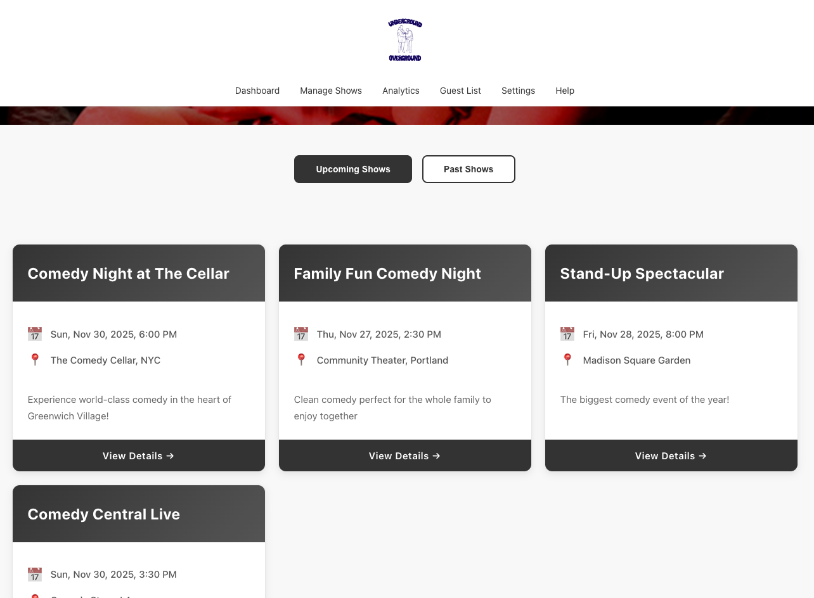
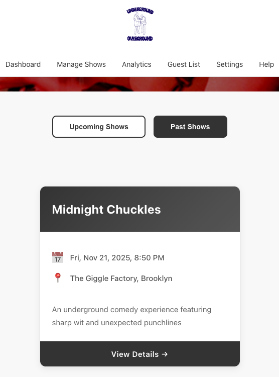
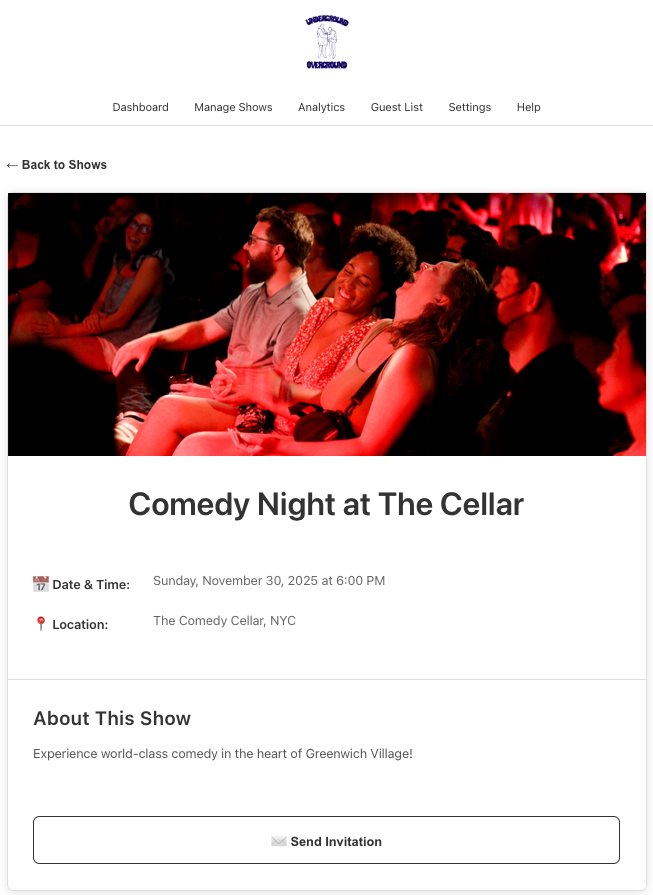
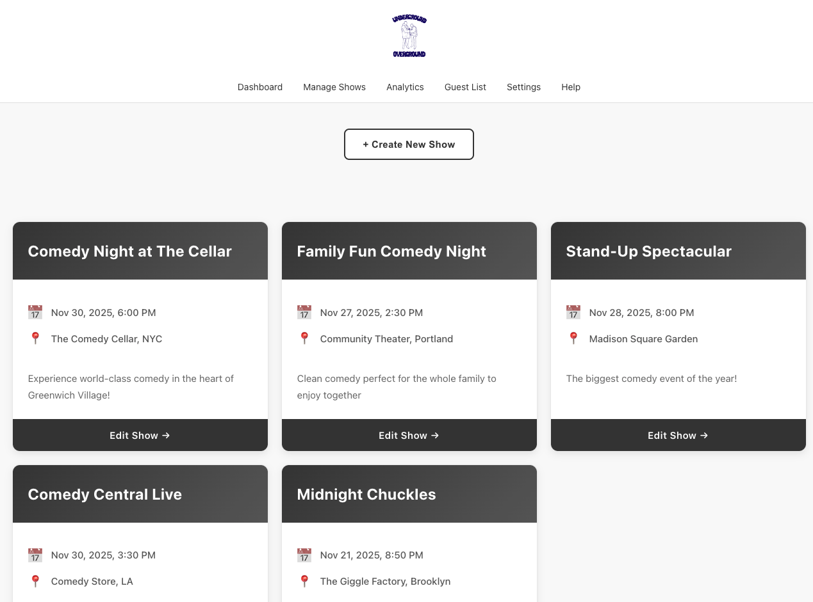
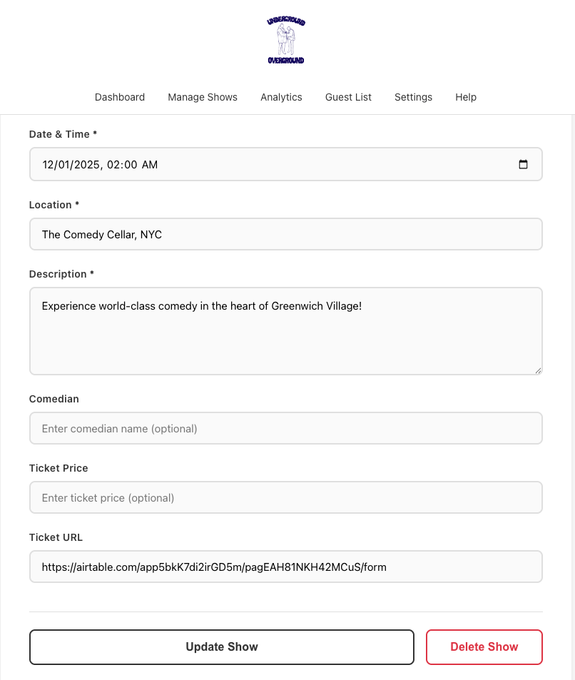
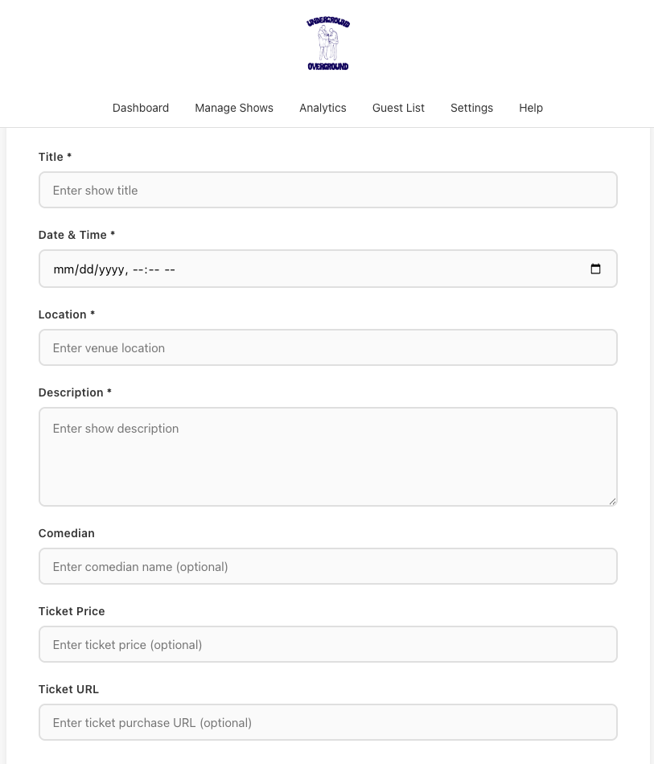

# Comedy Shows App

A React application for browsing and managing comedy shows with serverless backend, **Airtable** database, and **SendGrid** email integration.

## Features

### Original Requirements

Create a react application that displays 3 upcoming comedy shows with the following:

- Show title, date/time, and location
- A short description
- A details page
- Include filters for “Upcoming” vs “Past” shows
- Create 2 python API endpoints to back the react application
  - One to perform CRUD operations on the show object
  - The other hydrate and send emails to guests (admin@comedyuo.com) from the react app at the click of a button
- Build a site using a no code tool with a link to the shows tickets

Deliverable:
Upload to Vercel/Netlify and share the live link + GitHub repo

Email template to hydrate

### Additional Features

- **Hero Carousel** - Auto-activates when > 6 shows
- **Admin Panel** - Full CRUD operations at `/manage-shows`
- **Email Invitations** - Personalized emails with show details via SendGrid
- **Clean UI** - White theme with outlined buttons

### Tech Stack

- **Frontend:** React 18 + Vite
- **Backend:** Netlify Serverless Functions (Node.js)
- **Database:** Airtable
- **Email Service:** SendGrid
- **Deployment:** Netlify

> **Note:** Other Navigation links in the header are placeholders and not yet configured. They may be implemented in future updates.

## Running the App Locally

### Prerequisites

- Node.js 18+
- Airtable account with API key
- SendGrid account with API key

### Setup

1. **Clone and install dependencies:**

   ```bash
   git clone <your-repo-url>
   cd comedy-shows-app
   npm install
   npm install -g netlify-cli
   ```

2. **Create `.env` file** in root directory:

   ```env
   AIRTABLE_API_KEY=your_airtable_personal_access_token
   AIRTABLE_BASE_ID=your_airtable_base_id
   AIRTABLE_TABLE_NAME=Shows
   SENDGRID_API_KEY=your_sendgrid_api_key
   ```

3. **Run the application** (requires 2 terminals):

   **Terminal 1 - Frontend:**

   ```bash
   npm run dev
   ```

   **Terminal 2 - Backend Functions:**

   ```bash
   netlify functions:serve --port 9999
   ```

## Hosted Website

The website is hosted at https://golden-cheesecake-8c6b34.netlify.app

### Dashboard Page

#### Upcoming Shows



#### Past Shows



#### Show Details and Send Invitation


Currently, the invitation is sent to admin@comedyuo.com

### Admin Dashboard

#### Shows List



#### Edit and Delete Show



#### Create Show


